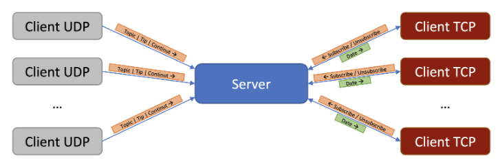

# TCP/UDP Server-Client Communication

## Overview

<p align="center">
  
</p>

This project consists of a server which accepts both TCP and UDP clients. The UDP clients are used to send messages to the server as a subscribtion provider. Then the server sends the messages to the TCP clients that are subscribed to the topics. The server also has the ability to send messages to all the clients that are connected to it. Also, the server accepts wildcard topics.

## Implementation

### Server

The server is implemented using the poll system call. The server is implemented following the structure of the laboratory, but adapted to the requirements of the homework. Initially, three values are added to poll_fds (tcp_connection, udp_connection and stdin), and during the execution, values are added and removed according to the events.


There are three cases:
* TCP connection request -> accepts the connection and adds the client to the list of active clients
* UDP connection request -> accepts the connection and go through the list of clients and the topics they are subscribed to and send the corresponding messageses
* Message from a client:
    * "ID" type        -> we check if it is in our list of active subscribers and if not, we add it
    * "subscribe" type -> we add the topic to the list of topics the client is subscribed to
    * "unsubscribe"    -> we remove the topic from the list

The server has two core structures:
```cpp
struct client_id_table {
    char id[10];
    int socket_fd;
};
```
* client_id_table -> a structure that retains the id of the active client and the corresponding socket
```cpp
map<char *, vector<string>> topic_map;
```
* topic_map -> a map that retains the client's id as a key and the topics it is subscribed to

The implementation of topic_map and client_id_table is separate to facilitate saving information even if the client disconnects.

### Wildcard implementation

The implementation of wildcard for topics follows a greedy method. We go through character by character and check if they match. If a '*' character is encountered, we save the position of this character from the pattern and also save the position of the last checked character from the text. When 'last_star_index' is different from -1 and the characters are different (that is, the iteration checks, for example, 'precis' with '/', the next character in the pattern) the iteration continues until the next similar character is found.

### Client

The client has a simple structure, it has only two file descriptors, one for tcp and one to communicate with stdin. If the subscriber receives a message from the server, it displays it. If it reads from the keyboard, it sends the message to the server and displays the corresponding messages.


## Additional information

In order to test the server and other features, please read the [Assignment](./Assignment_PCOM_2023-2024.pdf) which contains all the requirements and the way to test the server.